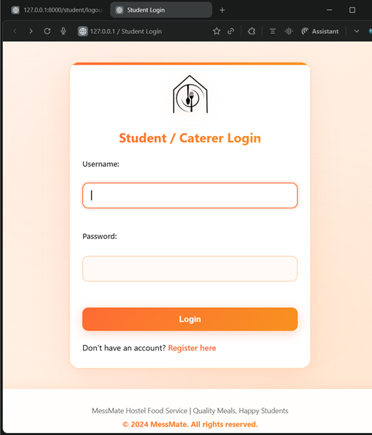
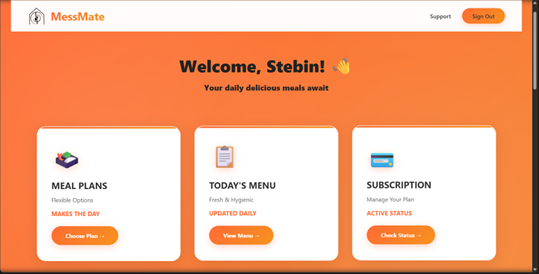
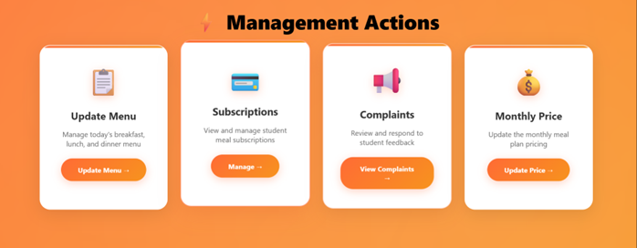
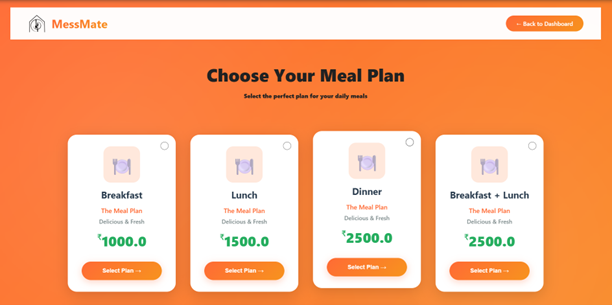
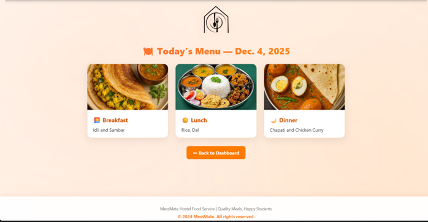

# Django Fullstack Mess Management System

A full-stack Hostel Mess Management System built using Django to streamline hostel dining operations for students and caterers.

## Features

* User Authentication & Authorization
* Meal Subscription Management
* Daily Menu Management
* Complaint & Feedback System
* Student & Caterer Dashboards
* Analytics and Reports
* Automated Mess Operations
* Responsive Fullstack Web Interface

## Tech Stack

* Backend: Django, Python
* Frontend: HTML, CSS, JavaScript
* Database: SQLite / MySQL
* Version Control: Git & GitHub

## Project Overview

This project digitizes hostel mess operations by providing an efficient platform for managing meals, subscriptions, complaints, and daily mess activities. It helps reduce manual work and improves communication between students and mess administrators.

## Future Enhancements

* Online Payment Integration
* QR-based Meal Verification
* Mobile Application Support
* AI-based Food Demand Prediction

## Project Screenshots

| Login Page | Dashboard |
|------------|------------|
|  |  |

| Menu Management | Meal Plan 
|-----------------|------------|
|  |  |

| Meals |
|-------|
|  |

## Author

Stebin Limson
